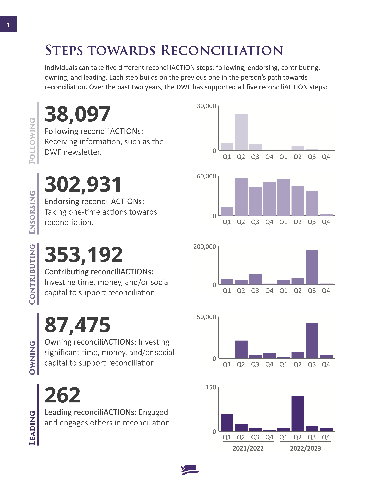
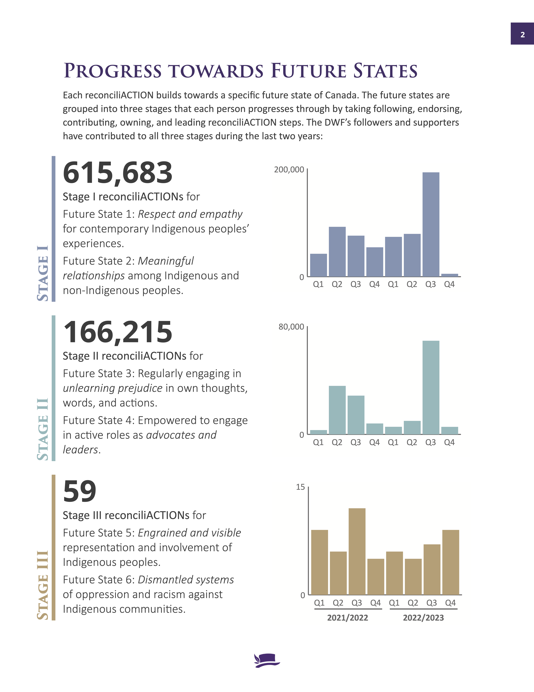
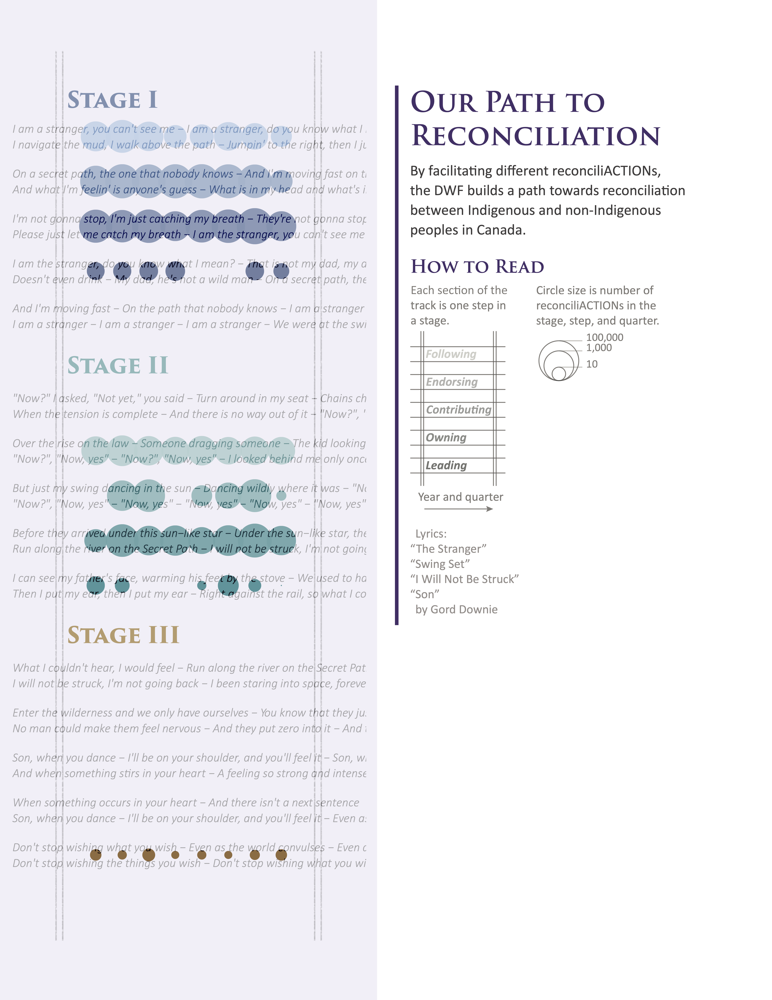
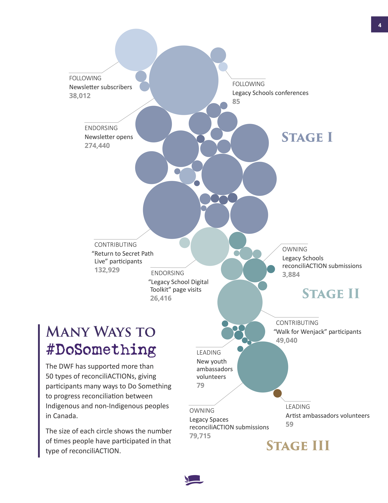

# Viz for Social Good Project: DWF ReconciliACTIONs

## About the project

This work was a volunteer project for [Viz for Social Good (VFSG) in partnership with the Gord Downie & Chanie Wenjack Fund (DWF)](https://www.vizforsocialgood.com/join-a-project/2023/gord-downie-chanie-wenjack-fun). The DWF aims to build cultural understanding and create a path towards reconciliation between Indigenous and non-Indigenous peoples in Canada.

License: [CC BY-NC 4.0](https://creativecommons.org/licenses/by-nc/4.0/)

## Deliverables

See the folder “dwf_deliverables” for the final visualisations:
* A PDF report of reconciliACTIONs for financial years 2021/2022 and 2022/2023 ("dwf_report.pdf")
* The individual pages of the PDF report ("dwf_report_individual_pages")
* Separate files of the main figures with DWF and VFSG logos ("standalone_vis")

## Acknowledgments

I used a slightly modified version of a generative art system designed by Danielle Navarro to make the irregular and smudged shapes in the #DoSomething tracking template. Her code is included in the art_functions.R script and is licensed under a [Creative Commons Attribution 4.0 International License](https://github.com/rstudio-conf-2022/art-from-code/blob/main/LICENSE.md). The code is available from the [Art from Code tutorial, session 3](https://art-from-code.netlify.app/day-1/session-3/) and the associated [GitHub page]( https://github.com/rstudio-conf-2022/art-from-code).

Descriptions of the DWF and VFSG organisations are from their language guidelines and website, respectively.

## Design process

This project was an opportunity to stretch my design skills and practice layout, typography, and colour design concepts. It was also my first time working with branding guidelines outside of academic journal figure requirements. 

### Tools

R, Adobe Illustrator, and Adobe InDesign. 

### Storytelling

The DWF asked for visualisations that allowed them to explore and communicate their impact, as measured by reconciliACTIONs: meaningful actions that progress reconciliation between Indigenous and non-Indigenous peoples in Canada. I decided to make a report in a style similar to their [yearly reports](https://downiewenjack.ca/news-publications/annual-report/). 

The report first lays out definitions for steps and stages (part of the DWF’s model for measuring the impact of reconciliACTIONs), while visualising progress within each of these categories. These first visualisations and descriptions give the reader a big picture overview of the DWF’s progress as well as a foundation for understanding the DWF’s model of reconciliACTIONs. 

  

The next pages then explore reconciliACTIONs using the combined categorisation into both steps and stages, with each stage broken down into the five possible reconciliACTION steps. One visualisation shows how the number of reconciliACTIONs in each combined category changed over time, while the other shows the contributions of different types of reconciliACTIONs, coloured by their categories. 

  

Finally, I end with a call-to-action to Do Something to progress reconciliation by providing a template for tracking reconciliACTIONs. The latter was inspired by the DWF’s comment that they do not have reconciliACTION data at the level of individuals – i.e., they do not know which actions any one person has taken. I therefore wanted to invite people to track their own progress. I decided to distinguish between steps, but not stages, on the tracking template since it may be more difficult for non-experts to categorise their reconciliACTIONs by stages. Additionally, most people’s reconciliACTIONs will be in only one or two of the stages, at least in the near future.

 

The final page of the report provides short descriptions the DWF and VFSG, as well as ways for people to find out more information about these two organisations.

 

### Colours and symbols

I worked with the DWF’s brand colours, but I also expanded the colour palette using three main hues from the striking colour palette of one of their main resources, *The Secret Path* film. I used the cooler hues to represent earlier stages of reconciliACTIONs, allowing the warming of the colour palette to symbolise the progression of reconciliation. Meanwhile, each step within each stage is encoded by the lightness of the hue. The colour therefore darkens as the steps become more difficult, which corresponds nicely to the increased impact of the latter steps. The combined hue and lightness encoding allowed me to visualise the combined categorisation of each reconciliACTION in the report’s latter visualisations. 

I also incorporated imagery and art that is central to the DWF’s messaging and identity, including *Secret Path* lyrics, train tracks, and watercolour artwork. 

### Data decisions

I decided to use the simpler DWF model of “stages” of reconciliACTIONs, rather than the categorisation into “future states” of Canada, which would have doubled the number of categories. Based on my initial data explorations, I felt that the simpler stages representation captured most of the variability in the types of reconciliACTIONs thus far, and I therefore sacrificed some level of detail to make the visualisations more accessible. Further, since the report is geared towards DWF supporters and stakeholders, I thought the stages description was most appropriate since it focuses on the development of individual participants in their path to reconciliation. However, I did tie the stages back to the future states description to explain how stages fit in to the DWF’s more detailed model. 

Some of the reconciliACTIONs had negative numbers due to a decrease in the net number of newsletter subscribers. As suggested by the DWF, I decided to transform these negative numbers to zero to prevent them from detracting from other reconciliACTIONs in the same category. My reasoning was that unsubscribing did not undo or negate the participant’s previous action of subscribing. Additionally, the unsubscribing participants may decide to continue their reconciliation journey using other approaches, such as following the DWF on social media. If possible, the DWF could separately track the number of new subscriptions and unsubscriptions in future quarters to have different options for tracking these reconciliACTIONs. 

I also combined newsletter subscribers and mailable newsletter subscribers into one category for the “Many Ways to #DoSomething” visualisation of different reconciliACTION types.

### Brainstorming

I’ve always gravitated towards sketching out visualisation ideas, but – inspired by reading about graphic and visualisation designers’ processes – I decided to more systematically incorporate sketches into developing these visualisations. Throughout the project, I used sketches to test out different ideas for vis types, layouts, and encodings. I sketched out initial ideas after first listening to the DWF’s Viz for Social Good presentation, but I also made sure to look at the data early on to understand its limitations and the feasibility of my approach. For example, I saw early on that the different scales in the data would make it tricky to compare reconciliACTIONs across different categories. I returned to sketching throughout the project to refine my early ideas, overcome roadblocks, and test out new ideas.

Sketch photos TBA

